# Implemented Architecture

This document maps the system as it exists now. It is meant to help you orient
before reading code, not to describe the long-term product vision.

## System Graph

```mermaid
flowchart TD
    Main["main.py"] --> UI["app/ui.py<br/>Gradio layout and event wiring"]
    UI --> Callbacks["app/callbacks.py<br/>UI handlers"]
    Callbacks --> AppState["app/state.py<br/>lazy Settings + RAGPipeline"]
    Callbacks --> AppFormatting["app/formatting.py<br/>Markdown/table formatting"]

    AppState --> Pipeline["pipeline.py<br/>RAGPipeline integration point"]
    Callbacks --> Analysis["agents/graph.py<br/>LangGraph analysis path"]
    Callbacks --> Discovery["corpus/discovery.py<br/>rank discovered sources"]
    Callbacks --> Acquisition["corpus/acquisition.py<br/>download/ingest source jobs"]

    Pipeline --> Security["security.py<br/>query + upload validation"]
    Pipeline --> Parser["ingestion/parser.py<br/>PDF to parsed sections"]
    Pipeline --> Chunker["ingestion/chunker.py<br/>section-aware chunks"]
    Pipeline --> Metadata["ingestion/metadata_extractor.py<br/>title/author extraction"]
    Pipeline --> Registry["ingestion/registry.py<br/>local document registry"]
    Pipeline --> Store["retrieval/store.py<br/>Chroma vector store"]
    Pipeline --> Retriever["retrieval/retriever.py<br/>embed query + top-k chunks"]
    Pipeline --> Prompt["generation/prompts.py<br/>grounded RAG prompt"]
    Pipeline --> LLM["generation/llm.py<br/>OpenAI chat wrapper"]

    Analysis --> Evidence["agents/evidence.py<br/>stance-specific query expansion + packs"]
    Analysis --> State["agents/state.py<br/>LangGraph state shape"]
    Analysis --> Stances["agents/stance.py<br/>materialist/idealist/dualist memos"]
    Analysis --> Grounding["agents/grounding.py<br/>synthesis + citation adjudication"]
    Analysis --> ClaimAudit["agents/claim_extraction.py<br/>agents/claim_verification.py"]
    Analysis --> ArgMap["agents/argument_map.py<br/>deterministic argument map"]
    Stances --> Schemas["agents/schema.py<br/>Pydantic contracts"]
    Grounding --> Schemas
    ClaimAudit --> Schemas
    ArgMap --> Schemas

    Discovery --> Providers["agents/source_search.py<br/>OpenAlex/Semantic Scholar/OpenAI providers"]
    Acquisition --> Resolvers["corpus/resolvers.py<br/>direct/Unpaywall/arXiv/S2 fallback"]
    Acquisition --> Pipeline
    Compat["agents/paper_tools.py<br/>compatibility facade"] --> Discovery
    Compat --> Acquisition
    Compat --> Resolvers

    Pipeline --> Ragas["eval/evaluator.py<br/>RAGAS answer/context eval"]
    Retriever --> RetrievalEval["eval/retrieval_evaluator.py<br/>chunk/source recall + precision"]
    Analysis --> AgentEval["eval/agent_evaluator.py<br/>deterministic agent eval"]
    Analysis --> AgentReport["eval/agent_report.py<br/>offline report runner support"]
    Retriever --> EvalGen["agents/eval_generation.py<br/>chunk-pinned eval generation"]
```



## Main Runtime Paths

### Manual PDF Ingestion

`app/ui.py` wires the upload controls to `app/callbacks.py`. The callback gets a
lazy `RAGPipeline` from `app/state.py`, then calls:

```text
parse -> chunk -> embed -> store -> register
```

Those steps are implemented in `pipeline.py` and delegate to ingestion,
retrieval, generation, registry, and security modules.

### Ask A Question

The Ask tab calls `handle_analysis()` in `app/callbacks.py`. That calls
`agents/graph.py::run_analysis()`, which:

1. Builds a LangGraph state graph.
2. Retrieves base evidence and stance-specific evidence.
3. Runs materialist, idealist, and dualist stance agents in parallel.
4. Runs the grounding agent.
5. Generates a baseline answer from the same retrieved context.
6. Extracts and verifies claims.
7. Builds a deterministic argument map.

The UI then formats the baseline, stance memos, claim audit, synthesis, argument
map, and retrieved sources through `app/formatting.py`.

### Discover And Acquire Sources

The Add Sources tab calls `corpus/discovery.py` through the UI callback. Source
providers currently live in `agents/source_search.py`. Acquisition uses
`corpus/acquisition.py`, resolves PDFs through `corpus/resolvers.py`, and can
ingest downloaded PDFs through the same `RAGPipeline`.

`agents/paper_tools.py` remains as a compatibility facade for older imports. New
source/corpus work should prefer the `corpus/` modules.

## Core vs Optional Paths

| Path | Status | Main files |
|---|---|---|
| Single-pipeline RAG | Core, implemented | `pipeline.py`, `ingestion/`, `retrieval/`, `generation/` |
| LangGraph multi-agent analysis | Core, implemented | `agents/graph.py`, `agents/state.py`, `agents/stance.py`, `agents/grounding.py` |
| Claim audit and argument map | Core, implemented deterministic post-processing | `agents/claim_extraction.py`, `agents/claim_verification.py`, `agents/argument_map.py` |
| Source discovery/acquisition | Implemented, still experimental as product workflow | `agents/source_search.py`, `corpus/` |
| Plain Python orchestration | Comparison baseline | `agents/plain.py` |
| CrewAI orchestration | Optional comparison path | `agents/crewai.py` |
| RAGAS evals | Implemented harness, paid/model-dependent | `eval/evaluator.py`, `scripts/run_eval.py` |
| Deterministic evals | Implemented and CI-friendly | `eval/agent_evaluator.py`, `eval/retrieval_evaluator.py` |

## Where To Re-Orient

If you get lost, return to these three files:

- `phil_mind_rag/pipeline.py`: how core RAG pieces connect.
- `phil_mind_rag/agents/graph.py`: how the agent analysis flow runs.
- `phil_mind_rag/app/callbacks.py`: how the UI calls into the system.
