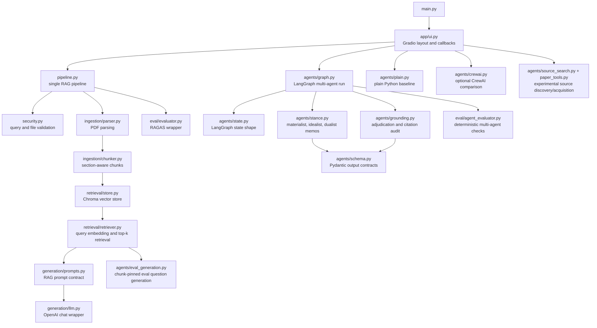

# Learning Guide

This repo is both a portfolio project and a learning project. Read it as a
small RAG system that grew a multi-agent analysis layer, not as a finished
research product.

The current north star is:

> Auditable philosophy-of-mind argument analysis over a curated corpus.

That means the system should retrieve evidence, generate stance-specific
arguments, audit claims against sources, and expose disagreement clearly.

## High-Level Graph



## Mental Model

The core product path is:

1. Parse a PDF into document sections.
2. Chunk the sections without crossing section boundaries.
3. Embed each chunk.
4. Store embeddings and metadata in Chroma.
5. Embed a user question.
6. Retrieve the nearest chunks.
7. Ask the LLM to answer only from those chunks.

The multi-agent path reuses the same retrieved chunks:

1. Retrieve chunks for the question.
2. Send those chunks to materialist, idealist, and dualist stance agents.
3. Each stance agent returns a structured `StanceMemo`.
4. A grounding agent reads all memos and retrieved chunks.
5. The grounding agent returns a structured `SynthesisReport`.
6. Deterministic checks flag missing or invalid chunk citations.

The important limitation: the current stance agents mostly differ by prompt.
The roadmap work should make them differ behaviorally through stance-specific
retrieval, claim verification, and argument maps.

## Reading Order

### 1. Project Story

Read `README.md` first.

Learn:

- what the repo claims to do
- what is implemented now
- what is experimental or planned
- how to run the app and checks

Then read `docs/design.md`.

Learn:

- the stance-agent design
- the anti-prompt-theater principle
- the intended LangGraph flow
- the current evaluation philosophy

### 2. Configuration

Read `phil_mind_rag/config.py`.

Learn:

- how `pydantic-settings` maps environment variables into typed settings
- where model names, chunk sizes, storage paths, and limits come from
- why most modules should receive settings instead of reading env vars directly

Useful test:

- `tests/conftest.py` for test settings and fixtures

### 3. Pipeline Wiring

Read `phil_mind_rag/pipeline.py`.

Learn:

- how parsing, chunking, embedding, storage, retrieval, and generation connect
- why this file is the main integration point
- how `query_with_sources()` differs from `retrieve()`
- how `answer_from_contexts()` lets evals and agents reuse retrieved chunks

Useful test:

- `tests/test_pipeline.py`

### 4. Ingestion

Read these together:

- `phil_mind_rag/ingestion/parser.py`
- `phil_mind_rag/ingestion/chunker.py`
- `phil_mind_rag/ingestion/metadata_extractor.py`
- `phil_mind_rag/ingestion/registry.py`

Learn:

- how PDFs become structured text
- why chunks preserve section boundaries
- how overlap protects against losing context at chunk edges
- how document metadata and local registry state are tracked

Useful tests:

- `tests/test_chunker.py`
- `tests/test_metadata_extractor.py`
- `tests/test_registry.py`

### 5. Retrieval

Read these together:

- `phil_mind_rag/retrieval/store.py`
- `phil_mind_rag/retrieval/retriever.py`

Learn:

- what the vector-store interface abstracts
- how Chroma stores chunk text, metadata, and embeddings
- how query embeddings become nearest-neighbor results
- how cosine distance is converted into a similarity-like score

Useful test:

- `tests/test_retriever.py`

### 6. Generation

Read these together:

- `phil_mind_rag/generation/prompts.py`
- `phil_mind_rag/generation/llm.py`

Learn:

- the prompt contract that makes the answer grounded
- how retrieved chunks are formatted for the LLM
- where the OpenAI chat call is wrapped
- what should be faked in tests instead of calling the network

Useful test:

- `tests/test_prompts.py`

### 7. Security Boundaries

Read `phil_mind_rag/security.py`.

Learn:

- how user queries are checked for simple prompt-injection patterns
- how uploaded documents are validated by extension and size
- why this is a basic demo boundary, not full document-security coverage

Useful test:

- `tests/test_security.py`

### 8. Agent Contracts

Read `phil_mind_rag/agents/schema.py`.

Learn:

- why structured outputs matter for multi-agent systems
- what a `StanceMemo` must contain
- what a `SynthesisReport` must contain
- how source citations are represented as chunk IDs

Useful tests:

- `tests/test_agents.py`
- `tests/test_agent_evaluator.py`

### 9. Agent Behavior

Read these together:

- `phil_mind_rag/agents/prompts.py`
- `phil_mind_rag/agents/stance.py`
- `phil_mind_rag/agents/grounding.py`
- `phil_mind_rag/agents/_llm.py`

Learn:

- how stance prompts are built
- how structured output is requested from OpenAI
- how the grounding agent merges LLM judgment with deterministic citation checks
- what is real behavior now versus prompt-level differentiation

### 10. Orchestration Frameworks

Read in this order:

1. `phil_mind_rag/agents/plain.py`
2. `phil_mind_rag/agents/graph.py`
3. `phil_mind_rag/agents/crewai.py`

Learn:

- how the same flow looks without a framework
- how LangGraph models the flow as state passed through nodes
- what CrewAI adds as a role/task abstraction
- why optional framework support should be compared honestly

Current flow:

```text
question -> retrieve -> stance memos in parallel -> grounding -> report
```

### 11. Evals

Read these together:

- `phil_mind_rag/eval/evaluator.py`
- `phil_mind_rag/eval/agent_evaluator.py`
- `phil_mind_rag/agents/eval_generation.py`
- `scripts/run_eval.py`
- `data/eval_set.json`

Learn:

- what RAGAS evaluates
- why deterministic evals are valuable
- how valid citations differ from semantically supported citations
- why future evals need expected chunk IDs

Useful tests:

- `tests/test_evaluator.py`
- `tests/test_agent_evaluator.py`
- `tests/test_eval_generation.py`

### 12. UI Last

Read `phil_mind_rag/app/ui.py` last.

Learn:

- how Gradio wires buttons, tabs, and callback functions
- how the app exposes ingestion, retrieval, source discovery, acquisition, and
  multi-agent analysis
- why this file is a cleanup target: it currently mixes layout, callbacks,
  formatting, and lazy singleton construction

Useful test:

- `tests/test_ui.py`

## Framework Map

| Framework/tool | Where it appears | What to understand |
|---|---|---|
| OpenAI embeddings | `pipeline.py` | Chunks and queries are embedded into the same vector space. |
| OpenAI chat | `generation/llm.py`, `agents/_llm.py` | Generation is wrapped so tests can use fakes. |
| Chroma | `retrieval/store.py` | Local persistent vector store and nearest-neighbor search. |
| Unstructured | `ingestion/parser.py` | PDF parsing into structured text. |
| Pydantic | `agents/schema.py`, `config.py` | Settings and structured agent output contracts. |
| LangGraph | `agents/graph.py`, `agents/state.py` | Explicit state-machine orchestration. |
| CrewAI | `agents/crewai.py` | Optional role/task comparison path. |
| RAGAS | `eval/evaluator.py` | LLM-judged RAG quality metrics. |
| Gradio | `app/ui.py` | Browser UI for the pipeline. |
| Ruff / ty / pytest | `pyproject.toml`, `tests/` | Quality gates and deterministic tests. |

## How To Study It

Use this loop:

1. Read one module.
2. Read the matching tests.
3. Run the focused tests.
4. Explain the module in your own words.
5. Only then move to the next layer.

Example:

```bash
uv run pytest tests/test_chunker.py -v
uv run pytest tests/test_retriever.py -v
uv run pytest tests/test_agents.py -v
```

If you get lost, return to `pipeline.py`. It is the map of the core RAG
system.
